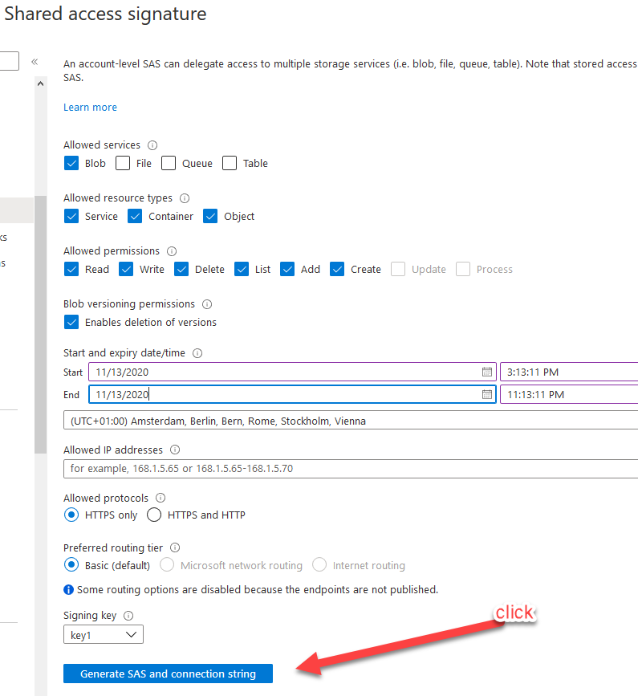
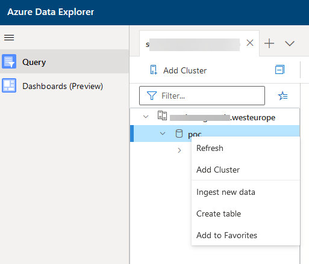

## Why would anyone...

I was looking for a convinient way to query and aggregate raster data (e.g. satellite images) with Azure PaaS services. Yes I know there is plenty of other cloud services, open-source tools and commercial products that are well suited for this. But that's not the point here :) I decided to give Azure Data Explorer (ADX) a try with the problem as I previously had great experiences with it.

## Finding data to ingest.

This example uses  [MOD13A1.006](https://lpdaac.usgs.gov/products/mod13a1v006/) from NASA that contains [Normalized Difference Vegetation Index (NDVI)](https://en.wikipedia.org/wiki/Normalized_difference_vegetation_index) values for the whole globe. I chose it mainly because it's easily available as [Cloud Optimized GeoTiff](https://www.cogeo.org/) from AWS S3. The approach should work with any raster data however. 

Because each image took so much space and after conversion even more, I used a VM in Azure to do the job.
For this VM I installed following tools:
* GDAL 2.4.2
* AWS CLI
* AZ CLI

### Extract

The source I used is https://modis-vi-nasa.s3-us-west-2.amazonaws.com/ and you can start by copying example image with following command:

`aws s3 cp s3://modis-vi-nasa/MOD13A1.006/2018.03.22.tif ./`

Each image is about 1.5Gb  and present NDVI measurements of the whole globe. Each pixel in the image is a value between 0 and 1. There are areas that were not measured by the satellite. These are presented with value -3000. 

### Transform

To ingest the image into ADX, it needs to be in text/row format. I used GDAL to convert the Tiff into CSV file with following command:

`gdal_translate -of xyz -co ADD_HEADER_LINE=NO -co COLUMN_SEPARATOR="," 2018.03.22.tif /vsistdout | grep -v "\-3000" > 2018.03.22.csv`

The pipe with grep in the command is about filtering the 'non values' out. Otherwise the result will get really big.
The gdal_translate AFAIK does not work with multiple bands when using xyz translation. In this case you need either convert each band to a different file and then merge them, or just write a python script that does the transformation using the GDAL library (or find one from Github).

GDAL will generate some unwanted content in the begining of the file which you can remove with this command:

`ex -sc '1d1|x' 2018.03.22.csv`

You will likely notice that the file is really big and any operations are going to take lot of time :)

ADX does not ingest files larger than 2G. With `ls -lah` we can see that our CSV file is already 21G. To fix that and make following operations faster, let's split the file to smaller chunks. To use `split`command, we need to first know how many lines are there in the file. You can count number of the lines relatively fast with command:

`dd if=2018.03.22.csv bs=256M | wc -l`

If we split the result of 352424394 lines with 20 then we should get number of lines we need for about 1G chunks. 10000000 is close enough :).  To split the file with this number, use command:

`split -l 10000000 2018.03.22.csv 2018.03.22- --additional-suffix=.csv`

Next we add date column into the CSV file for later use in ADX. The date must be in a format recognized by ADX ([ISO 8601](https://www.iso.org/iso-8601-date-and-time-format.html)). Here we use 2018-03-22. 

`sed -i "s/$/,2018-03-22/" 2018.03.22-*.csv`

That is the transformation done. Finally let's archive the original CSV file, so that it does not affect the commands executed later.
`gzip 2018.03.22.csv`

### Load
Let's push the files into Azure Blob Storage for ADX ingestion. First we need to create a storage account and there a blob storage container that we call 'modis' (or what ever you want :), just remember the name later ). [Check out these docs if you don't know how.](https://docs.microsoft.com/en-us/azure/storage/blobs/storage-quickstart-blobs-portal)

Then copy from the access-keys part of your storage account page (in azure portal) the connection string. Export this into your shell environment with:
`export AZURE_STORAGE_CONNECTION_STRING="THEKEYICOPIEDFROMAZUREPORTAL"`

With this, you can upload all the csv files into the container (named modis) with single command:
`az storage blob upload-batch -d modis -s . --pattern "*.csv"`

## Ingest to ADX

To start your ingest, [first create a ADX cluster and a database.](https://docs.microsoft.com/en-us/azure/data-explorer/create-cluster-database-portal) 

Create a Shared Access Signature (_SAS_) for your storage account. This is a URL that allows the ADX connect into your protected storage. Think it as a link that also contains a password. The page where you generate it looks like this:



Make sure you have selected all the resource types (Service, Container, Object) before clicking Generate button

Copy the 'Blob service SAS URL' that it generated. It should be something like https://storageaccountname.blob.core.windows.net/?sv=1203u120938LOTOFTHINGS
you need to append the name of your container (modis) to the end of the link, so that it looks like this:
https://storageaccountname.blob.core.windows.net/modis?sv=1203u120938LOTOFTHINGS

Then let's go to the newly created ADX:

Right click your database and select 'ingest new data'


This should open a screen like this:


Here select source type 'from container' instead of blob. Add your modified _SAS url_ into the _link to storage_ field.
Set _Sample Size_ to be larger than number of files you uploaded to the storage. The files from your storage should appear into the box beneath. Select one of the files, and click *Edit Schema*.

The default settings in Schema should be ok. Set the datatype of Column4 to datetime, if its not automatically correct.

After this let's wait a bit and then run some queries.

## Query and aggregate 
I draw a random square (with geojson.io) near _Curry_ that looks like this: 


The polygon is overlaid with the NDVI values from the raster. You can see that the pixels in the raster are not straight squares. This is because how the satellite is positioned. [Find out more here.](https://modis-land.gsfc.nasa.gov/MODLAND_grid.html)

How to find out what is the average NDVI over this region between all the dates we uploaded?
Here is the query that will do that for you.
```sql
let curry = dynamic({  
        "type": "Polygon",  
        "coordinates":  [[[-87.21136093139648, 33.87953701355924], 
                          [-87.0663070678711, 33.87953701355924],
                          [-87.0663070678711, 33.944499207394635],  
                          [-87.21136093139648,33.944499207394635],
                          [-87.21136093139648,33.87953701355924]]]  
      });  
MODIS   
| where geo_point_in_polygon(Column1, Column2, curry)  
| summarize avg(Column3) by Column4  
| render timechart
```

Okay that was not too bad. The ingestion part could be easily automated and the query part looks nice enough :D 

### Work to do

The query performance seems to grow linearly with the amount of days I have uploaded. I still need to do some benchmarking and optimization.

The approach to convert something like MODIS data into points was likely a bit naivistic. There seems to be slight difference with reference calculations I did with [Google Earth Engine](https://earthengine.google.com/).

If we look the leftmost points returned by the ADX query overlaid with the area and the NDVI layer, it's clear there is some sort of projection error. Oh well, at least we cannot blame ADX calculating wrong here :) 


## Notes

ADX database seems to grow linearly. Single 1.5G raster ingestion inceased size by 4G. This 1.5G was 500x500m resolution landmass image.

There is still no autoshutdown feature in ADX. Remember to turn it off after your experiments specially with larger VM sizes.

